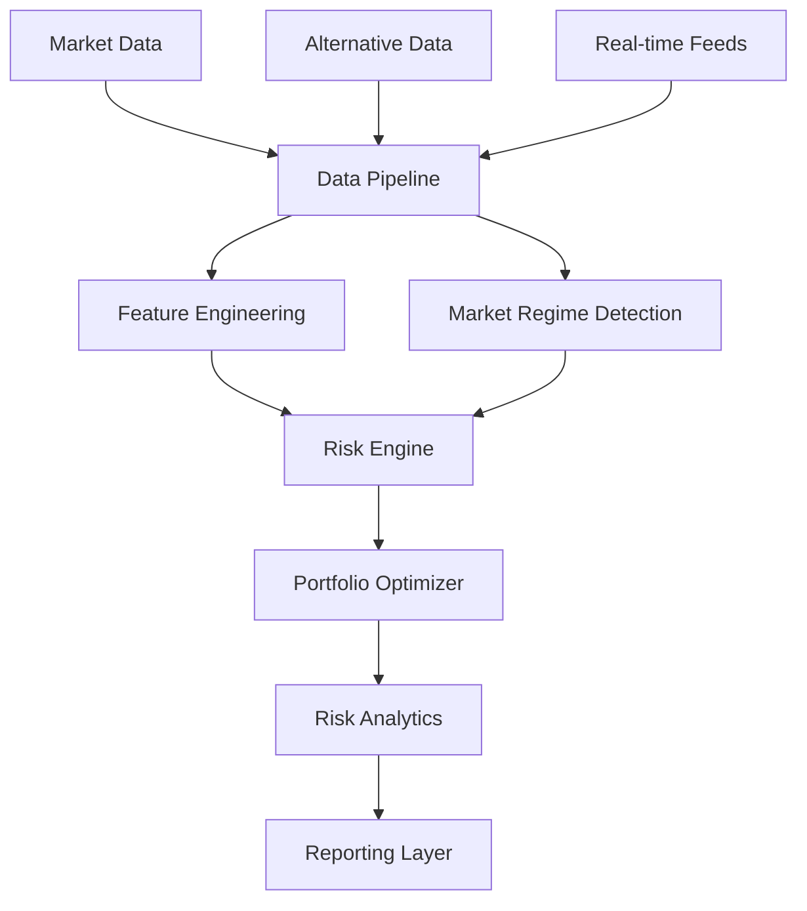

# Portfolio Risk Analysis Framework - PUBLIC VERSION !!!WORK IN PROGRESS!!!
A sophisticated quantitative framework combining Monte Carlo simulation, machine learning, and advanced risk metrics (classwork)

[](https://www.python.org/downloads/)
[](LICENSE)

## 🚀 Overview

This framework provides a comprehensive solution for portfolio risk analysis by combining state-of-the-art quantitative methods:

- **🤖 Machine Learning Integration**: 
  - Advanced regime detection using Gaussian Mixture Models
  - Pattern recognition for market states
  - Dynamic feature engineering

- **⚡ High-Performance Monte Carlo**: 
  - GPU-accelerated simulations (not sure)
  - Parallel processing capabilities
  - Efficient memory management

- **📊 Dynamic Risk Management**:
  - Real-time portfolio optimization
  - Continuous risk monitoring
  - Adaptive risk thresholds

- **🔄 Market Microstructure**: 
  - Transaction cost modeling
  - Market impact analysis
  - Liquidity considerations

## 🏗️ Architecture



## 🔧 Core Components

### 1. Market Analysis Engine
- GMM-based regime detection
- GARCH volatility forecasting
- Dynamic feature extraction
- Real-time market state analysis

### 2. Advanced Risk Metrics
- Conditional Value at Risk (CVaR)
- Expected Shortfall (ES)
- Maximum Drawdown (MDD)
- Conditional Drawdown at Risk (CDaR)
- Omega Ratio
- Modified Sharpe Ratio

### 3. Monte Carlo Engine
 
A sophisticated Monte Carlo simulation engine that combines historical scenarios, regime detection, and advanced risk management features for robust portfolio analysis.

### Key Features

- **Advanced Scenario Generation**:
  - Historical market crashes (COVID-19, Black Monday, Lehman Brothers)
  - Macroeconomic scenarios (Hyperinflation, Currency Crisis, Stagflation)
  - Regime-dependent return generation
  - GARCH volatility forecasting integration

- **Risk Management Framework**:
  - Dynamic position sizing
  - Stop-loss and take-profit mechanisms
  - Transaction cost modeling
  - Maximum drawdown monitoring
  - Leverage constraints

- **Performance Analytics**:
  - Comprehensive risk metrics (VaR, CVaR)
  - Risk-adjusted returns (Sharpe, Sortino)
  - Drawdown analysis
  - Scenario-specific impact assessment

### Usage Example
```python
# Initialize Monte Carlo engine with custom configuration
engine = MonteCarloEngine(
    signals=trading_signals,
    returns=historical_returns,
    config=SimConfig(
        n_sims=10000,
        horizon=252,
        use_garch=True,
        regime_detection=True
    )
)

# Run simulation and analyze results
portfolio_values, metrics = engine.simulate()
```

The engine provides a robust framework for stress testing portfolios under various market conditions while maintaining strict risk management controls.

## Stress Test Scenarios

The Monte Carlo simulation includes various stress scenarios to test portfolio resilience:

### Historical Market Events (16%)
- **COVID-19 Crash** (5%)
  - Volatility: 4x normal
  - Return Impact: -15%
  - Correlation: +50%

- **2008 Financial Crisis** (4%)
  - Volatility: 3.5x normal
  - Return Impact: -18%
  - Correlation: +60%

- **Black Monday** (3%)
  - Volatility: 5x normal
  - Return Impact: -23%
  - Correlation: +70%

- **Tech Bubble Burst** (4%)
  - Volatility: 2.5x normal
  - Return Impact: -8%
  - Correlation: +30%

### Market Stress Events (15%)
- **Hyperinflation** (3%)
  - Volatility: 4x normal
  - Return Impact: -20%
  - Correlation: +60%

- **Currency Crisis** (3%)
  - Volatility: 3x normal
  - Return Impact: -15%
  - Correlation: +50%

- **Liquidity Crisis** (3%)
  - Volatility: 2.5x normal
  - Return Impact: -15%
  - Correlation: +40%

- **Volatility Spike** (3%)
  - Volatility: 3x normal
  - Return Impact: -10%
  - Correlation: +80%

- **Stagflation** (3%)
  - Volatility: 2.5x normal
  - Return Impact: -12%
  - Correlation: +40%

### Positive Scenarios (19%)
- **Tech Breakthrough** (4%)
  - Volatility: 3x normal
  - Return Impact: +25%
  - Correlation: -30%

- **Economic Boom** (5%)
  - Volatility: 2x normal
  - Return Impact: +20%
  - Correlation: -20%

- **Market Recovery** (5%)
  - Volatility: 1.5x normal
  - Return Impact: +15%
  - Correlation: -10%

- **Global Growth** (5%)
  - Volatility: 1.8x normal
  - Return Impact: +18%
  - Correlation: -15%

### Base Scenario (50%)
- Normal market conditions
- No additional stress factors applied


## GARCH Implementation

A sophisticated GARCH (Generalized Autoregressive Conditional Heteroskedasticity) model implementation for volatility forecasting and regime detection. The model features:

### Key Features

- **Enhanced Preprocessing**:
  - Robust outlier detection using z-score methodology
  - Intelligent missing value handling
  - Configurable volatility targeting and rescaling

- **Flexible Model Configuration**:
  - Customizable GARCH(p,q) parameters
  - Multiple distribution options (Student's t, Normal, etc.)
  - Adjustable volatility targeting with annual standardization
  - Power GARCH support

- **Advanced Analytics**:
  - Volatility regime detection with dynamic thresholds
  - Confidence interval generation for forecasts
  - Comprehensive model diagnostics
  - Parameter stability checks

### Usage Example
```python
# Initialize GARCH model with custom configuration
model = EnhancedGARCHModel(
    config=GARCHConfig(
        p=1,                    # GARCH lag order
        q=1,                    # ARCH lag order
        dist='studentst',       # Error distribution
        vol_targeting=True,     # Enable volatility targeting
        target_vol=0.15        # Annual volatility target
    )
)

# Fit model and generate forecasts
fitted_models = model.fit(returns_data)
forecasts = model.forecast_volatility(horizon=5)
```

The implementation provides a robust foundation for risk modeling and volatility forecasting within the broader portfolio management framework.


## Gaussian Mixture Model (GMM) Implementation

A sophisticated market regime detection system using Gaussian Mixture Models with enhanced statistical features. This implementation provides robust market state classification and transition probability analysis.

### Key Features

- **Advanced Regime Detection**:
  - Multi-regime classification (default: 3 states)
  - Probabilistic state assignments
  - Dynamic regime transition analysis
  - Risk-based regime mapping

- **Statistical Analysis**:
  - Comprehensive regime statistics
  - Transition probability matrices
  - Duration analysis per regime
  - Higher-order moments (skewness, kurtosis)
  - Risk metrics (VaR, CVaR) per regime

- **Flexible Configuration**:
  - Customizable number of regimes
  - Multiple covariance structures
  - Robust initialization options
  - Convergence controls

### Usage Example
```python
# Initialize GMM model with custom configuration
model = MarketRegimeGMM(
    config=GMMConfig(
        n_components=3,          # Number of regimes
        covariance_type='full',  # Covariance structure
        min_regime_prob=0.1      # Minimum regime probability
    )
)

# Fit model and analyze regimes
model.fit(returns_data)
current_regime = model.detect_regime(recent_returns)
regime_summary = model.get_regime_summary()
```

The model provides a sophisticated framework for market regime detection, enabling adaptive portfolio management strategies based on market conditions.
  
## 📦 Installation

### Prerequisites
- Python 3.8+
- CUDA toolkit (optional, for GPU support)
- Virtual environment (recommended)

```bash
# Create virtual environment
python -m venv venv

# Activate environment
source venv/bin/activate  # Unix/macOS
.\venv\Scripts\activate  # Windows

# Install dependencies
pip install -r requirements.txt
```


## 📚 Mathematical Foundation

### Return Calculation
$$R_t = \frac{P_t - P_{t-1}}{P_{t-1}}$$

### Portfolio Value Evolution
$$V_t = V_{t-1}(1 + R_t - c|\Delta w_t|)$$

where:
- $V_t$ is portfolio value at time t
- $R_t$ is return at time t
- $c$ is transaction cost
- $\Delta w_t$ is change in position

### Key Risk Metrics
- VaR: $P(R_p \leq VaR_\alpha) = \alpha$
- Sharpe: $SR = \frac{E[R_p] - R_f}{\sigma_p}$
- Maximum Drawdown: $MDD = \min_t{\frac{V_t - \max_{s\leq t}V_s}{\max_{s\leq t}V_s}}$

## 🔬 Implementation Details

### Advanced Features
- Regime-switching models
- Dynamic volatility forecasting
- Transaction cost optimization
- Machine learning-based signal generation
- Real-time portfolio rebalancing

### Performance Optimizations
- Vectorized operations
- GPU acceleration
- Parallel processing
- Memory efficient algorithms

# Trading Signals Generator

A sophisticated algorithmic trading signal generator that combines multiple technical indicators with adaptive thresholds for robust market analysis. The system employs a multi-factor approach to identify high-probability trading opportunities while managing risk (this was another project that I've merged with this one).

## Key Features

- **Adaptive Volatility Filtering**: Dynamically adjusts signal thresholds based on market volatility regimes
- **Multi-Factor Signal Generation**:
  - Exponential Moving Average (EMA) crossovers
  - Enhanced RSI with dynamic overbought/oversold levels
  - Momentum and trend strength analysis
  - Volume-weighted signal confirmation
- **Risk Management**:
  - Intelligent position sizing based on signal strength
  - Maximum simultaneous positions limit
  - Volatility-based exposure control
  - Signal confidence thresholds

## Signal Generation Process

1. **Market Context Analysis**
   - Volatility regime detection
   - Trend identification using EMA crossovers
   - Momentum evaluation across multiple timeframes

2. **Signal Confirmation**
   - RSI divergence validation
   - Trend strength assessment
   - Volume and volatility filters

3. **Risk Filters**
   - Dynamic threshold adjustment
   - Position concentration limits
   - Signal strength ranking

The system is designed to adapt to changing market conditions while maintaining a disciplined approach to risk management.

## 🤝 Contributing (only for authorised users)

### Development Workflow
1. Fork the repository
2. Create a feature branch
3. Install development dependencies
4. Run tests and linting
5. Submit pull request

### Code Standards
- Follow PEP 8 guidelines
- Include comprehensive docstrings
- Add unit tests for new features
- Use type hints consistently

## 📖 References

### Academic Literature
1. Bollerslev, T. (1986). "Generalized Autoregressive Conditional Heteroskedasticity"
2. McNeil, A.J., Frey, R. (2000). "Estimation of Tail-Related Risk Measures"
3. Hamilton, J.D. (1989). "A New Approach to the Economic Analysis of Time Series"
4. Ang, A., Bekaert, G. (2002). "Regime Switches in Interest Rates"
5. Maïnassara, Y.B., Kadmiri O., Saussereau B. (2022). "Estimation of multivariate asymmetric power GARCH models"
6. Cunchala, A. (2024). "A Basic Overview of Various Stochastic Approaches to Financial Modeling With Examples"
7. Goyal, A., Welch, I., "A Comprehensive 2022 Look at the Empirical Performance of Equity Premium Prediction"
8. Jondeau, E., Rockinger, M. (2006). "The copula-garch model of conditional dependencies: An international stock market application"


### Key Resources
1. "Advances in Financial Machine Learning" by Marcos López de Prado
2. "Machine Learning for Asset Managers" by Marcos López de Prado
3. "Active Portfolio Management" by Grinold and Kahn

## 📄 License

Commercial Software License

Copyright © 2024 Lucas Kemper

**All Rights Reserved**

### Usage Terms:
- **Commercial Use**: Requires paid license
- **Academic/Personal Use**: 
  - Permitted for non-commercial research
  - Must credit original work
  - Cannot be used in production

### Contact
For licensing and commercial use:
- Email: contact@lucaskemper.com
- Website: [www.lucaskemper.com](http://www.lucaskemper.com)

---
**Note**: This project is under active development. Features and documentation may be updated frequently.
