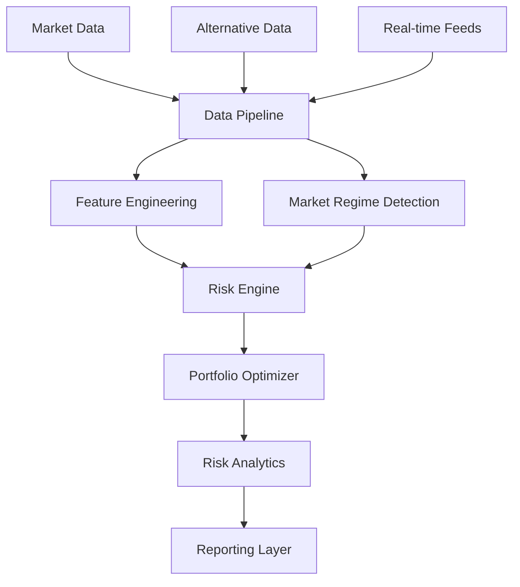

# Portfolio Risk Analysis using Monte Carlo Simulation and Machine Learning /w Antonio Schoeffel, HEC Lausanne (WORK IN PROGRESS)
A sophisticated quantitative framework combining Monte Carlo simulation, machine learning, and advanced risk metrics, developed as part of a project for the class "Data Science & Advanced Programming, Year 1, MscF HEC Lausanne",

## Table of Contents
- [Overview](#overview)
- [Architecture](#architecture)
- [Core Components](#core-components)
- [Installation](#installation)
- [Implementation Details](#implementation-details)
- [Mathematical Foundation](#mathematical-foundation)
- [Usage Guide](#usage-guide)
- [Performance Optimization](#performance-optimization)
- [Contributing](#contributing)
- [References](#references)

## Overview

This framework provides a comprehensive solution for portfolio risk analysis by combining state-of-the-art quantitative methods:

- **Machine Learning Integration**: Advanced regime detection and pattern recognition
- **High-Performance Monte Carlo**: Efficient simulation with GPU acceleration support
- **Dynamic Risk Management**: Real-time portfolio optimization and risk monitoring
- **Market Microstructure**: Transaction cost modeling and market impact analysis

## Architecture



## Core Components

### 1. Market Analysis Engine
```python
class MarketAnalyzer:
    def __init__(self, config: MarketConfig):
        self.regime_detector = GMMRegimeDetector(
            n_components=config.n_regimes,
            covariance_type='full',
            random_state=42
        )
        self.vol_forecaster = GARCHModel(
            p=1, q=1,
            vol_targeting=True
        )

    def detect_regime(self, returns: np.ndarray) -> Dict[str, float]:
        """
        Detect market regime using GMM and returns probability of each state
        """
        features = self._extract_regime_features(returns)
        return self.regime_detector.predict_proba(features)
```

### 2. Advanced Risk Metrics

#### Key Risk Indicators (KRIs)
- Conditional Value at Risk (CVaR)
- Expected Shortfall (ES)
- Maximum Drawdown (MDD)
- Conditional Drawdown at Risk (CDaR)
- Omega Ratio
- Modified Sharpe Ratio (Very promising)

```python
class RiskMetrics:
    def calculate_cvar(self, returns: np.ndarray, 
                      confidence_level: float = 0.95) -> float:
        """
        Calculate Conditional Value at Risk with kernel density estimation
        """
        var = self._calculate_var(returns, confidence_level)
        return -np.mean(returns[returns <= -var])

    def calculate_cdar(self, returns: np.ndarray, 
                      confidence_level: float = 0.95) -> float:
        """
        Calculate Conditional Drawdown at Risk
        """
        drawdowns = self._calculate_drawdown_series(returns)
        return self.calculate_cvar(drawdowns, confidence_level)
```

### 3. Monte Carlo Engine

```python
class EnhancedMonteCarloEngine:
    def __init__(self, config: SimulationConfig):
        self.n_sims = config.n_sims
        self.horizon = config.horizon
        self.use_gpu = config.use_gpu
        self.random_state = np.random.RandomState(42)
        
        if self.use_gpu:
            import cupy as cp
            self.xp = cp
        else:
            self.xp = np

    async def simulate(self, 
                      initial_portfolio: Portfolio,
                      market_conditions: MarketState) -> SimulationResult:
        """
        Run regime-aware Monte Carlo simulation with parallel processing
        """
        paths = []
        with concurrent.futures.ThreadPoolExecutor() as executor:
            futures = [
                executor.submit(self._single_path_simulation,
                              initial_portfolio,
                              market_conditions)
                for _ in range(self.n_sims)
            ]
            paths = [f.result() for f in futures]
        
        return self._aggregate_results(paths)
```

## Installation

```bash
# Create virtual environment
python -m venv venv
source venv/bin/activate  # Unix
.\venv\Scripts\activate  # Windows

# Install dependencies
pip install -r requirements.txt
```

### Dependencies

```toml
[packages]
numpy = "^1.21.0"
pandas = "^1.3.0"
scipy = "^1.7.0"
scikit-learn = "^0.24.2"
torch = "^1.9.0"
pymc3 = "^3.11.0"
arch = "^4.19"
matplotlib = "^3.4.0"
seaborn = "^0.11.0"
plotly = "^5.1.0"
dash = "^2.0.0"

[dev-packages]
pytest = "^6.2.5"
black = "^21.7b0"
flake8 = "^3.9.0"
mypy = "^0.910"
```

## Implementation Details

### Advanced Signal Generation

```python
class SignalGenerator:
    def __init__(self, config: SignalConfig):
        self.lookback = config.lookback
        self.vol_window = config.vol_window
        self.momentum_window = config.momentum_window
        self.regime_weight = config.regime_weight
        
    def generate(self, 
                 prices: pd.DataFrame, 
                 market_state: MarketState) -> pd.DataFrame:
        """
        Generate trading signals using multiple factors and regime awareness
        """
        signals = pd.DataFrame(index=prices.index, columns=prices.columns)
        
        # Calculate technical factors
        momentum = self._calculate_momentum(prices)
        volatility = self._calculate_volatility(prices)
        regime_signal = self._get_regime_signal(market_state)
        
        # Combine signals with regime weighting
        combined_signal = (
            momentum * (1 - self.regime_weight) +
            regime_signal * self.regime_weight
        )
        
        # Apply volatility scaling
        signals = combined_signal * self._get_vol_scaling(volatility)
        
        return signals.clip(-1, 1)  # Enforce position limits
```

### Portfolio Optimization

```python
class PortfolioOptimizer:
    def optimize(self, 
                universe: Universe,
                constraints: Constraints,
                risk_targets: RiskTargets) -> Portfolio:
        """
        Optimize portfolio weights using risk-aware optimization
        """
        def objective(weights):
            portfolio_risk = self._calculate_portfolio_risk(weights, universe)
            return -self._calculate_risk_adjusted_return(weights, universe) + \
                   self._risk_penalty(portfolio_risk, risk_targets)
        
        result = minimize(
            objective,
            x0=self._get_initial_weights(universe),
            constraints=self._convert_constraints(constraints),
            method='SLSQP'
        )
        
        return Portfolio(weights=result.x, metadata=result)
```


## Contributing (only for authorised users)

### Development Setup
1. Fork the repository
2. Create a feature branch
3. Install development dependencies
4. Run tests and linting
5. Submit pull request

### Code Style
- Follow PEP 8 guidelines
- Use type hints
- Write comprehensive docstrings
- Include unit tests

## References

### Academic Literature
1. Bollerslev, T. (1986). "Generalized Autoregressive Conditional Heteroskedasticity"
2. McNeil, A.J., Frey, R. (2000). "Estimation of Tail-Related Risk Measures"
3. Hamilton, J.D. (1989). "A New Approach to the Economic Analysis of Time Series"
4. Ang, A., Bekaert, G. (2002). "Regime Switches in Interest Rates"


### Additional Resources
1. "Advances in Financial Machine Learning" by Marcos López de Prado
2. "Machine Learning for Asset Managers" by Marcos López de Prado
3. "Active Portfolio Management" by Grinold and Kahn

Mathematical Framework

Return Calculation

R_t = \frac{P_t - P_{t-1}}{P_{t-1}}
Portfolio Value Evolution

V_t = V_{t-1}(1 + R_t - c|\Delta w_t|)
where:

$V_t$ is portfolio value at time t
$R_t$ is return at time t
$c$ is transaction cost
$\Delta w_t$ is change in position
Risk Metrics

VaR: $P(R_p \leq VaR_\alpha) = \alpha$
Sharpe: $SR = \frac{E[R_p] - R_f}{\sigma_p}$
Maximum Drawdown: $MDD = \min_t{\frac{V_t - \max_{s\leq t}V_s}{\max_{s\leq t}V_s}}$
## License

Commercial Software License

Copyright (c) 2024 Lucas Kemper

While this code is publicly visible, it is NOT open-source software.
All rights reserved.

Commercial Use Terms:
1. Any commercial use requires a paid license
2. Companies must contact contact@lucaskemper.com for licensing
3. Usage without a commercial license is strictly prohibited
4. Derivatives must maintain these terms

Academic/Personal Use:
- Permitted for non-commercial research and learning
- Must credit the original work
- Cannot be used in production environments

For licensing and commercial use, contact: contact@lucaskemper.com
